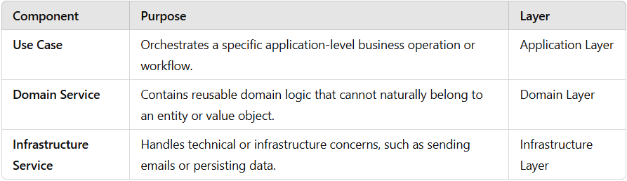
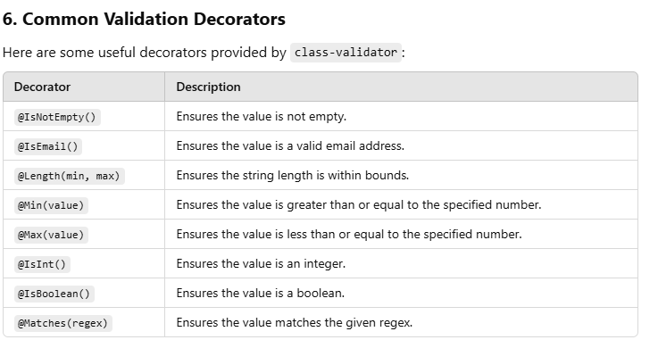

# CoolTool Microservices

## Run Project

```sh
cd cooltool.service.example-user
npm i
npm run start:dev
```

## Create a new microservice

1. Setup Your NestJS Microservices

```sh
npx @nestjs/cli new cooltool.service._NAMESERVICE_
cd user-service
npm install --save @nestjs/microservices
```

2. Add Microservices Logic
Configure User Service
Inside the cooltool.service._NAMESERVICE_ folder:

Install Swagger dependencies:
```sh
npm install --save @nestjs/swagger swagger-ui-express
```

3. Structure Microservice

```sh
src/
├── application/
│   ├── use-cases/
│   │   ├── create-user.use-case.ts
│   │   └── get-user.use-case.ts
│   └── dtos/
│       └── create-user.dto.ts
├── domain/
│   ├── entities/
│   │   └── user.entity.ts
│   ├── value-objects/
│   │   └── user-email.vo.ts
│   ├── services/
│   │   └── user-domain.service.ts
├── infrastructure/
│   ├── repositories/
│   │   └── user.repository.ts
│   ├── database/
│       └── prisma-client.ts
├── interfaces/
│   ├── controllers/
│   │   └── user.controller.ts
│   ├── subscribers/
│       └── user-event.subscriber.ts
├── shared/
│   └── utils/
├── app.module.ts
├── main.ts
```


### Why Use DDD for Microservices?
1. Separation of Concerns: Each layer has a distinct responsibility.
2. Scalability: Easily add new use cases or modify existing ones without affecting unrelated parts.
4. Testability: Layers are isolated, making it easier to test business logic independently.
5. Maintainability: Clear boundaries reduce technical debt over time.

### What is DDD?
DDD emphasizes organizing code around the domain (business logic), encapsulating domain models, and separating concerns. Common layers in a DDD structure are:

* Domain Layer: Contains the core business logic (Entities, Value Objects, Aggregates, Domain Services).
* Application Layer: Handles use cases and orchestrates interactions between the domain layer and infrastructure.
* Infrastructure Layer: Contains technical details like database access (Repositories) and third-party integrations.
* Interfaces Layer: Handles input/output, such as controllers, APIs, or event listeners.


### When to Use Service and UseCase


### Common Validation Decorators
